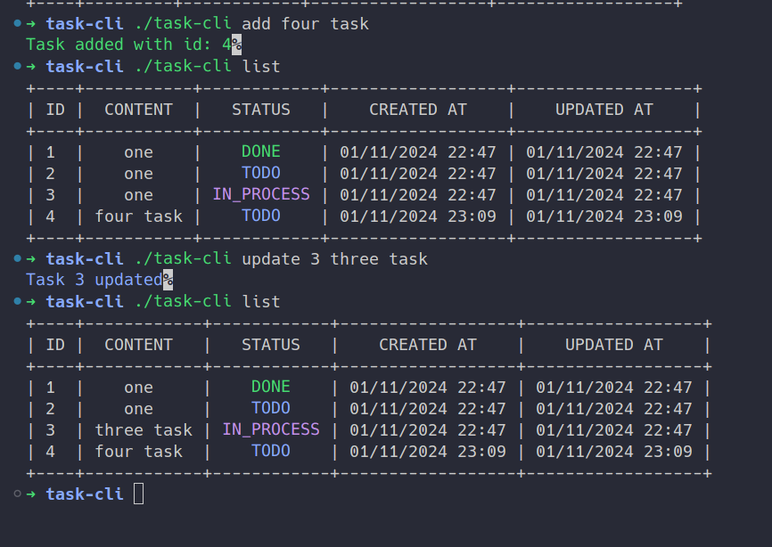

# Project Info

Task Tracker CLI base on Requirement in roadmap.sh, implement with golang + cobra

- use cobra for fast development because I not have too much time to do this.

## Main Feature

Manage task in your CLI with json database.

### Task Properties

Each task should have the following properties:

- `id`: A unique identifier for the task
- `content`: A short description of the task
- `status`: The status of the task (todo, in-progress, done)
- `createdAt`: The date and time when the task was created
- `updatedAt`: The date and time when the task was last updated

### Example usage

> This is Example from roadmap.sh. My Implement have some difference in message with create, update, delete.

```bash
# Adding a new task
task-cli add "Buy groceries"
# Output: Task added successfully (ID: 1)

# Updating and deleting tasks
task-cli update 1 "Buy groceries and cook dinner"
task-cli delete 1

# Marking a task as in progress or done
task-cli mark-in-progress 1
task-cli mark-done 1

# Listing all tasks
task-cli list

# Listing tasks by status
task-cli list done
task-cli list todo
task-cli list in-progress
```

### Some addition Feature

```bash
# Clear all task
task-cli clear

## Clear one or multi tasks (Other task id will reset from 1 to len(tasks))
task-cli clear 1 3 5
```

## Build It Yourself

Build your own task Management CLI base on this project

### Clone this repo

### Edit code then build execute file

Execute file with small size if `task-cli`. Please allow it execute to run.

```bash
go build -ldflags="-s -w" -o task-cli main.go
```

> Note: Your tasks data will be saved in task.json in same directory of your cli. **Please do not edit it**.

### Example:



## PR or Request new feature for me

- Github :`@thnhan3`

<p id="footer" align="center" style="padding:20px; margin-top:30px;rotate: calc(45deg); color: green; font-size: 2rem;">Have A nice day</p>
